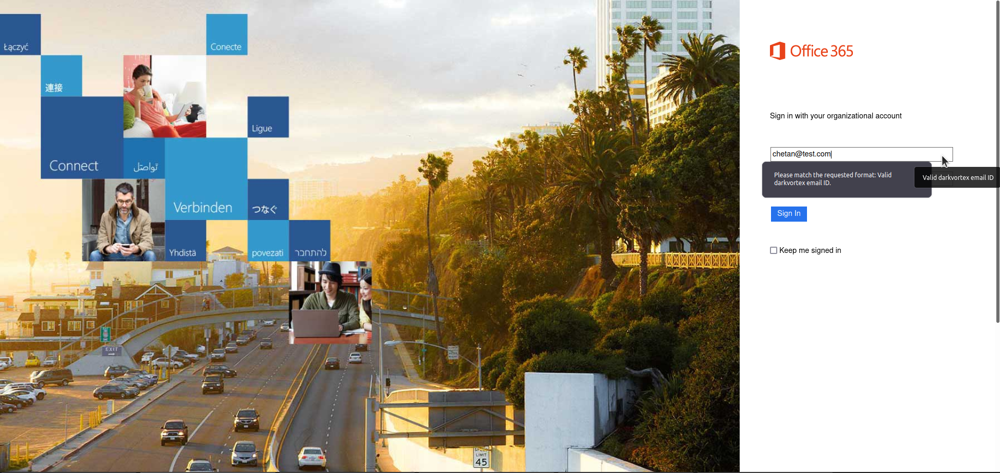
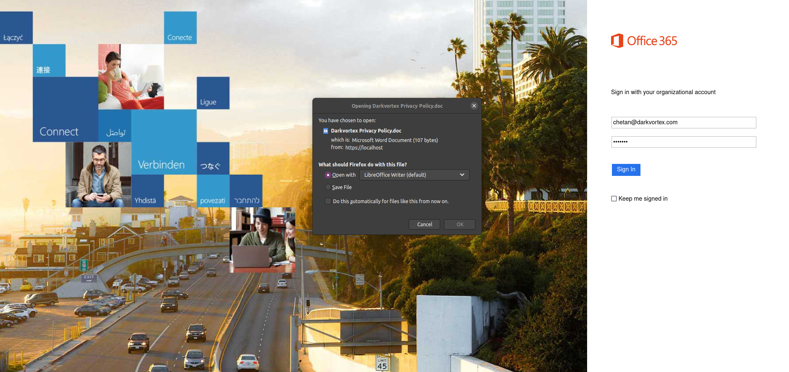

# O365-Doppelganger

O365-Doppelganger is NOT a replacement for hardcore phishing activities. There are several other tools which perform OAuth and OTA capture which is not the aim of O365-Doppelganger.

O365-Doppelganger is a quick handy script to harvest credentials of a user during Red Teams. This repository is a quick hack of one of my old red team engagement scripts which I've used several times to capture credentials and use them for making windows access tokens for lateral movement. This code repository basically performs the below tasks:

- The GO code:
  - hosts the O365 portal (can be replaced with anything in the index.html). It is recommended to use a valid cert and key file (LetsEncrypt?) instead of the one provided in the directory
  - logs all user activity on the web portal in a seperate log file on the server
  - logs the credentials captured in a seperate log file on the server
  - can also be used to return a valid file to the user post capturing the credentials. This can be done by replacing the file named `MacroFile.doc` in the current directory and replacing it with HTA/ISO/MSI or anything else that the phisher wants. Theres also a small code in the GO code which would need to be modified to specify the user's file name which needs to be returned: `content, err := ioutil.ReadFile("MacroFile.doc")`
  - Once modified, the target user when enters a valid email ID and password will be asked to save the above file. This file name can be changed using the below code in the GO file: `response.Header().Set("Content-Disposition", "attachment; filename=Darkvortex Privacy Policy.doc")`
- The index.html code:
  - renders an O365 portal alongside a small regex which checks for a given user's domain name to make it look a bit more legit. The regex code looks like this: `
pattern="^([a-zA-Z0-9_\-\.]+)@darkvortex\.([a-zA-Z]{2,5})$" title=" Valid darkvortex email ID"
`

  - The above regex checks if the given username contains a full valid email address else it will prompt the user to enter a correct username as follows:

  - This same check is also performed in the GO code so that user's do not use something like burp to bypass the check: `if strings.Contains(value[i], "@darkvortex") {`

  - It's recommended to change the name darkvortex in the index.html file to your own target company name.
  - Once the correct email ID and the password is entered, the user will be asked to save the provided file as follows:

